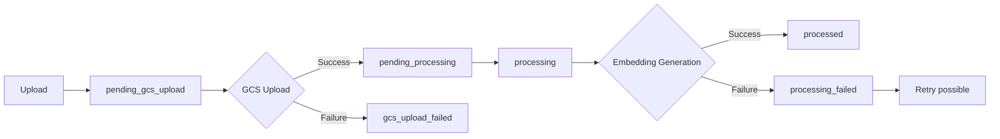

The Document Processing endpoint handles file uploads and AI-powered processing for PDFs, CSVs, Word documents, and Excel files. It extracts content, generates embeddings, and stores them in our vector database for intelligent search and retrieval within the workspace.

<Info>
**For newcomers**: Think of this as our "document intelligence system." When you upload a clinical guideline PDF or patient data spreadsheet, this endpoint processes it so our AI can search and reference the content later. It's like having a smart filing cabinet that understands what's inside each document.

**For senior devs**: Async document processing pipeline with Cohere embeddings, pgvector storage in Supabase, agentic chunking with GPT-4o-mini, and comprehensive status tracking. Supports direct upload and URL-based ingestion with retry mechanisms.
</Info>

## Overview

### Key Features
- **Multi-format support** - PDFs, CSVs, Word docs (.docx), and Excel files (.xlsx)
- **URL-based uploads** - Process documents directly from URLs
- **Async processing** - Non-blocking uploads with status tracking
- **Retry mechanism** - Retry failed processing without re-uploading
- **Vector embeddings** - AI-searchable content with Cohere embeddings
- **Workspace isolation** - Documents segregated by workspace

### Processing Pipeline
1. **File validation** - Verify supported format
2. **GCS upload** - Store in Google Cloud Storage
3. **Content extraction** - Parse document content
4. **Embedding generation** - Create vector embeddings with Cohere
5. **Vector storage** - Store in Supabase pgvector for search

### Why We Built It This Way
- **Async processing** - Large documents don't block the API
- **Retry without re-upload** - Saves bandwidth for failed processing
- **Workspace tables** - Better performance and data isolation
- **Public URLs** - Easy access for authorized users

## Authentication

```bash
X-API-Key: your-api-key
```

All document processing endpoints require API key authentication.

## Endpoints

### Upload Document

<CodeGroup>

```bash cURL
curl -X POST https://api.narra.com/api/v1/pdf-uploads/upload_pdf \
  -H "X-API-Key: your-api-key" \
  -F "workspace_id=ws_123" \
  -F "user_id=user_456" \
  -F "file=@clinical_guidelines.pdf"
```

```python Python
import requests

# Upload a PDF
with open('clinical_guidelines.pdf', 'rb') as f:
    files = {'file': ('clinical_guidelines.pdf', f, 'application/pdf')}
    data = {
        'workspace_id': 'ws_123',
        'user_id': 'user_456'
    }
    
    response = requests.post(
        "https://api.narra.com/api/v1/pdf-uploads/upload_pdf",
        headers={"X-API-Key": "your-api-key"},
        files=files,
        data=data
    )
    
    result = response.json()
    doc_id = result['doc_id']
```

```javascript JavaScript
// Upload from browser
const uploadDocument = async (file) => {
  const formData = new FormData();
  formData.append('workspace_id', 'ws_123');
  formData.append('user_id', 'user_456');
  formData.append('file', file);
  
  const response = await fetch('/api/v1/pdf-uploads/upload_pdf', {
    method: 'POST',
    headers: {
      'X-API-Key': apiKey,
    },
    body: formData
  });
  
  return response.json();
};
```

</CodeGroup>

**POST** `/pdf-uploads/upload_pdf`

Uploads a document for processing. Returns immediately with status while processing continues in background.

#### Request Body (multipart/form-data)

<ParamField body="workspace_id" type="string" required>
  The workspace ID for document isolation
</ParamField>

<ParamField body="user_id" type="string" required>
  The user ID uploading the document (for audit trail)
</ParamField>

<ParamField body="file" type="file" required>
  The document file. Supported formats:
  - PDF (.pdf)
  - CSV (.csv)
  - Word (.docx, .doc)
  - Excel (.xlsx)
</ParamField>

#### Response (202 Accepted)

```json
{
  "message": "Successfully processed clinical_guidelines.pdf",
  "doc_id": "550e8400-e29b-41d4-a716-446655440000",
  "filename": "clinical_guidelines.pdf",
  "status": "pending_processing",
  "public_url": "https://storage.googleapis.com/narra-media/uploads/ws_123/user_456/550e8400.../clinical_guidelines.pdf",
  "processing_outcome": "success"
}
```

<ResponseField name="doc_id" type="string">
  Unique document identifier (UUID) for tracking and future operations
</ResponseField>

<ResponseField name="status" type="string">
  Current processing status. One of:
  - `pending_gcs_upload` - Waiting for GCS upload
  - `pending_processing` - Uploaded, waiting for processing
  - `processing` - Currently generating embeddings
  - `processed` - Successfully completed
  - `processing_failed` - Failed (can retry)
  - `gcs_upload_failed` - Upload failed
</ResponseField>

<ResponseField name="public_url" type="string">
  Public URL to access the document file
</ResponseField>

### Upload from URL

<CodeGroup>

```bash cURL
curl -X POST https://api.narra.com/api/v1/pdf-uploads/upload-from-url \
  -H "X-API-Key: your-api-key" \
  -H "Content-Type: application/json" \
  -d '{
    "workspace_id": "ws_123",
    "user_id": "user_456",
    "file_url": "https://example.com/research_paper.pdf"
  }'
```

```python Python
import requests

# Process document from URL
response = requests.post(
    "https://api.narra.com/api/v1/pdf-uploads/upload-from-url",
    headers={
        "X-API-Key": "your-api-key",
        "Content-Type": "application/json"
    },
    json={
        "workspace_id": "ws_123",
        "user_id": "user_456",
        "file_url": "https://example.com/research_paper.pdf"
    }
)

result = response.json()
```

</CodeGroup>

**POST** `/pdf-uploads/upload-from-url`

Downloads and processes a document from a URL.

#### Request Body

<ParamField body="workspace_id" type="string" required>
  The workspace ID for document isolation
</ParamField>

<ParamField body="user_id" type="string" required>
  The user ID initiating the upload
</ParamField>

<ParamField body="file_url" type="string" required>
  URL of the document to download and process. Must be publicly accessible.
</ParamField>

#### Response

Same as `/upload_pdf` endpoint.

### Check Processing Status

<CodeGroup>

```bash cURL
curl https://api.narra.com/api/v1/pdf-uploads/550e8400-e29b-41d4-a716-446655440000/status \
  -H "X-API-Key: your-api-key"
```

```python Python
import requests
import time

# Poll for processing completion
def wait_for_processing(doc_id):
    while True:
        response = requests.get(
            f"https://api.narra.com/api/v1/pdf-uploads/{doc_id}/status",
            headers={"X-API-Key": "your-api-key"}
        )
        
        status_data = response.json()
        status = status_data['status']
        
        if status == 'processed':
            return status_data
        elif status == 'processing_failed':
            raise Exception(f"Processing failed: {status_data.get('error_message')}")
        
        time.sleep(5)  # Poll every 5 seconds
```

</CodeGroup>

**GET** `/pdf-uploads/{doc_id}/status`

Checks the current processing status of a document.

#### Path Parameters

<ParamField path="doc_id" type="string" required>
  The document ID returned from upload
</ParamField>

#### Response

```json
{
  "doc_id": "550e8400-e29b-41d4-a716-446655440000",
  "status": "processed",
  "filename": "clinical_guidelines.pdf",
  "uploaded_at": "2024-01-15T10:30:00Z",
  "processed_at": "2024-01-15T10:31:30Z",
  "error_message": null,
  "public_url": "https://storage.googleapis.com/narra-media/uploads/..."
}
```

<ResponseField name="uploaded_at" type="string">
  ISO timestamp when document was uploaded
</ResponseField>

<ResponseField name="processed_at" type="string">
  ISO timestamp when processing completed (null if not processed)
</ResponseField>

<ResponseField name="error_message" type="string">
  Error details if processing failed (null on success)
</ResponseField>

### Retry Failed Processing

<CodeGroup>

```bash cURL
curl -X POST https://api.narra.com/api/v1/pdf-uploads/pdf_processing/550e8400-e29b-41d4-a716-446655440000/retry \
  -H "X-API-Key: your-api-key" \
  -H "Content-Type: application/json" \
  -d '{
    "workspace_id": "ws_123",
    "user_id": "user_456"
  }'
```

```python Python
# Retry failed processing
response = requests.post(
    f"https://api.narra.com/api/v1/pdf-uploads/pdf_processing/{doc_id}/retry",
    headers={
        "X-API-Key": "your-api-key",
        "Content-Type": "application/json"
    },
    json={
        "workspace_id": "ws_123",
        "user_id": "user_456"
    }
)
```

</CodeGroup>

**POST** `/pdf-uploads/pdf_processing/{doc_id}/retry`

Retries processing for a failed document without re-uploading the file.

#### Request Body

<ParamField body="workspace_id" type="string" required>
  The workspace ID (must match original upload)
</ParamField>

<ParamField body="user_id" type="string" required>
  The user ID requesting the retry
</ParamField>

<Note>
Only documents with status `processing_failed` or `pending_processing` can be retried.
</Note>

### Delete Document

<CodeGroup>

```bash cURL
curl -X DELETE https://api.narra.com/api/v1/pdf-uploads/550e8400-e29b-41d4-a716-446655440000 \
  -H "X-API-Key: your-api-key"
```

```python Python
# Delete document and all associated data
response = requests.delete(
    f"https://api.narra.com/api/v1/pdf-uploads/{doc_id}",
    headers={"X-API-Key": "your-api-key"}
)
```

</CodeGroup>

**DELETE** `/pdf-uploads/{doc_id}`

Deletes a document and all associated data including:
- GCS file
- Firestore metadata
- Vector embeddings in Supabase

Returns 204 No Content on success.

## Processing Details

### Supported Formats

<AccordionGroup>
  <Accordion title="PDF Files">
    - Standard PDF documents
    - Scanned PDFs with OCR
    - Multi-page documents
    - Password-protected PDFs not supported
  </Accordion>
  
  <Accordion title="CSV Files">
    - Standard comma-separated values
    - Tab-separated values
    - Headers automatically detected
    - UTF-8 encoding recommended
  </Accordion>
  
  <Accordion title="Word Documents">
    - Modern format (.docx)
    - Legacy format (.doc)
    - Embedded images extracted
    - Tables preserved as text
  </Accordion>
  
  <Accordion title="Excel Files">
    - Modern format (.xlsx)
    - Automatically converted to CSV
    - First sheet processed by default
    - Formulas evaluated to values
  </Accordion>
</AccordionGroup>

### Processing States



### Vector Storage

Documents are processed into searchable chunks:

1. **Content Extraction** - Parse document text
2. **Intelligent Chunking** - Use GPT-4o-mini for context-aware splitting
3. **Embedding Generation** - Create vectors with Cohere `embed-v4.0`
4. **Vector Storage** - Store in Supabase pgvector

Table structure: `{workspace_id}_pdf_documents`

## Error Handling

<ResponseField name="400 Bad Request">
  Invalid file format or missing required fields
  ```json
  {
    "detail": "Unsupported file type. Supported types: PDF, CSV, DOCX, DOC, XLSX"
  }
  ```
</ResponseField>

<ResponseField name="404 Not Found">
  Document not found
  ```json
  {
    "detail": "Document 550e8400... not found"
  }
  ```
</ResponseField>

<ResponseField name="422 Unprocessable Entity">
  Processing errors or invalid retry attempts
  ```json
  {
    "detail": "Document status is 'processed'. Only documents with status 'processing_failed' or 'pending_processing' can be retried."
  }
  ```
</ResponseField>

<ResponseField name="500 Internal Server Error">
  GCS upload failures or unexpected errors
</ResponseField>

## Common Patterns

### Upload and Wait for Processing

```python
async def upload_and_wait(file_path: str, workspace_id: str, user_id: str):
    # Upload document
    with open(file_path, 'rb') as f:
        files = {'file': (file_path, f, 'application/pdf')}
        data = {'workspace_id': workspace_id, 'user_id': user_id}
        
        upload_response = requests.post(
            "/pdf-uploads/upload_pdf",
            headers={"X-API-Key": api_key},
            files=files,
            data=data
        )
    
    doc_id = upload_response.json()['doc_id']
    
    # Poll for completion
    while True:
        status_response = requests.get(
            f"/pdf-uploads/{doc_id}/status",
            headers={"X-API-Key": api_key}
        )
        
        status = status_response.json()['status']
        
        if status == 'processed':
            return doc_id
        elif status == 'processing_failed':
            # Attempt retry
            retry_response = requests.post(
                f"/pdf-uploads/pdf_processing/{doc_id}/retry",
                headers={"X-API-Key": api_key},
                json={'workspace_id': workspace_id, 'user_id': user_id}
            )
            
        await asyncio.sleep(5)
```

### Batch URL Processing

```python
def process_document_urls(urls: list, workspace_id: str, user_id: str):
    doc_ids = []
    
    for url in urls:
        response = requests.post(
            "/pdf-uploads/upload-from-url",
            headers={"X-API-Key": api_key},
            json={
                'workspace_id': workspace_id,
                'user_id': user_id,
                'file_url': url
            }
        )
        
        if response.status_code == 202:
            doc_ids.append(response.json()['doc_id'])
    
    return doc_ids
```

## Performance Tips

1. **Async processing** - Upload returns immediately, poll for status
2. **Batch uploads** - Process multiple documents in parallel
3. **URL uploads** - For large files, use URL upload to avoid client timeouts
4. **Retry wisely** - Only retry `processing_failed` status, not upload failures

## Integration Example

Here's how the mobile app typically handles document uploads:

```typescript
// React Native document picker integration
import DocumentPicker from 'react-native-document-picker';

const uploadDocument = async () => {
  try {
    const result = await DocumentPicker.pick({
      type: [
        DocumentPicker.types.pdf,
        DocumentPicker.types.csv,
        DocumentPicker.types.docx,
        DocumentPicker.types.xlsx,
      ],
    });
    
    const formData = new FormData();
    formData.append('workspace_id', currentWorkspace.id);
    formData.append('user_id', currentUser.id);
    formData.append('file', {
      uri: result[0].uri,
      type: result[0].type,
      name: result[0].name,
    } as any);
    
    const uploadResponse = await fetch('/pdf-uploads/upload_pdf', {
      method: 'POST',
      headers: { 'X-API-Key': apiKey },
      body: formData,
    });
    
    const { doc_id } = await uploadResponse.json();
    
    // Start polling for status
    pollDocumentStatus(doc_id);
    
  } catch (err) {
    if (DocumentPicker.isCancel(err)) {
      // User cancelled
    } else {
      throw err;
    }
  }
};

const pollDocumentStatus = (docId: string) => {
  const interval = setInterval(async () => {
    const response = await fetch(`/pdf-uploads/${docId}/status`, {
      headers: { 'X-API-Key': apiKey },
    });
    
    const status = await response.json();
    
    if (status.status === 'processed') {
      clearInterval(interval);
      showSuccess('Document processed successfully!');
      refreshDocumentList();
    } else if (status.status === 'processing_failed') {
      clearInterval(interval);
      showError('Processing failed. Retry?');
    }
  }, 5000);
};
```

## Debugging

<Tip>
Check these for processing issues:
- **CloudWatch logs**: `/aws/lambda/pdf-processing` for detailed errors
- **GCS console**: Verify files uploaded to correct paths
- **Firestore console**: Check `uploaded_documents` collection
- **Supabase logs**: Vector storage errors in pgvector tables
</Tip>

## Related Endpoints

- [AI Clinical Assistant](/api-reference/chat-v2) - AI assistant can search processed documents
- [Media Uploads](/api-reference/uploads) - For general media file uploads