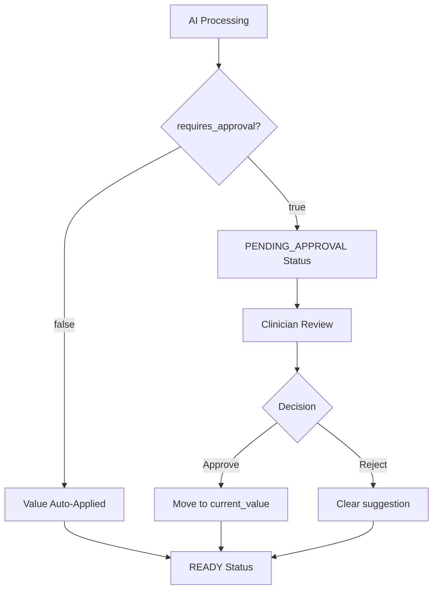

<Info>
**For newcomers**: Think of this as our "smart form builder" for clinical data. Create custom fields (like "primary diagnosis" or "blood pressure") that automatically extract relevant information from patient logs using AI, with human review when needed.

**For senior devs**: Map-Reduce AI processing architecture using Agno framework with GPT-4o-mini, semaphore-controlled concurrency, Firestore-based audit trails, and status-driven state machine for complex approval workflows. Supports 7 field types with runtime Pydantic model generation for validation.
</Info>

## Overview

NarraFields enables healthcare providers to create intelligent custom fields that automatically process unstructured patient logs and extract structured clinical data. The system combines AI-powered extraction with human oversight to ensure clinical accuracy and compliance.

### Key Features

- **7 Field Types**: Single Line Text, Long Text, Number, Select, Multi-Select, Date, Checkbox
- **AI-Powered Extraction**: Intelligent data extraction from unstructured patient logs
- **Approval Workflows**: Human review and approval for AI suggestions
- **Auto-Update Integration**: Automatic processing when new patient logs are created
- **Comprehensive Audit Trails**: Complete change tracking for healthcare compliance
- **Concurrent Processing**: Optimized Map-Reduce pattern for handling large patient populations
- **Citation Tracking**: Links extracted values back to source patient log entries

### Why We Built It This Way

Healthcare providers often need to track specific clinical indicators across their patient population, but manually reviewing hundreds of patient logs is time-consuming and error-prone. NarraFields automates this process while maintaining clinical oversight and audit compliance.

## Authentication

All NarraFields endpoints require authentication via the `X-API-Key` header.

```bash
curl -H "X-API-Key: your_api_key_here" \
  https://your-api-domain.com/api/v1/custom-fields/
```

## Field Management Endpoints

### Create Field Definition

<CodeGroup>
```bash cURL
curl -X POST "https://your-api-domain.com/api/v1/custom-fields/definitions" \
  -H "X-API-Key: your_api_key_here" \
  -H "Content-Type: application/json" \
  -d '{
    "workspace_id": "your_workspace_id",
    "user_id": "your_user_id",
    "field": {
      "field_name": "primary_diagnosis",
      "field_description": "Primary medical diagnosis for the patient based on clinical documentation",
      "field_type": "single_line_text", 
      "ai_enabled": true,
      "processing_behavior": {
        "auto_update": true,
        "overwrite_existing": false,
        "requires_approval": true
      },
      "fallback_strategy": {
        "user_instruction": "If no clear diagnosis is documented, respond with Diagnosis pending further evaluation"
      }
    }
  }'
```

```python Python
import requests

def create_diagnosis_field(api_key: str, workspace_id: str, user_id: str):
    url = "https://your-api-domain.com/api/v1/custom-fields/definitions"
    
    payload = {
        "workspace_id": workspace_id,
        "user_id": user_id,
        "field": {
            "field_name": "primary_diagnosis",
            "field_description": "Primary medical diagnosis for the patient based on clinical documentation",
            "field_type": "single_line_text",
            "ai_enabled": True,
            "processing_behavior": {
                "auto_update": True,
                "overwrite_existing": False,
                "requires_approval": True
            },
            "fallback_strategy": {
                "user_instruction": "If no clear diagnosis is documented, respond with Diagnosis pending further evaluation"
            }
        }
    }
    
    headers = {
        "X-API-Key": api_key,
        "Content-Type": "application/json"
    }
    
    response = requests.post(url, json=payload, headers=headers)
    return response.json()

# Usage
field = create_diagnosis_field("your_api_key", "workspace_123", "user_123")
print(f"Created field: {field['id']}")
```

```javascript JavaScript
async function createDiagnosisField(apiKey, workspaceId, userId) {
  const url = 'https://your-api-domain.com/api/v1/custom-fields/definitions';
  
  const payload = {
    workspace_id: workspaceId,
    user_id: userId,
    field: {
      field_name: 'primary_diagnosis',
      field_description: 'Primary medical diagnosis for the patient based on clinical documentation',
      field_type: 'single_line_text',
      ai_enabled: true,
      processing_behavior: {
        auto_update: true,
        overwrite_existing: false,
        requires_approval: true
      },
      fallback_strategy: {
        user_instruction: "If no clear diagnosis is documented, respond with Diagnosis pending further evaluation"
      }
    }
  };
  
  const response = await fetch(url, {
    method: 'POST',
    headers: {
      'X-API-Key': apiKey,
      'Content-Type': 'application/json'
    },
    body: JSON.stringify(payload)
  });
  
  return await response.json();
}

// Usage
const field = await createDiagnosisField('your_api_key', 'workspace_123', 'user_123');
console.log(`Created field: ${field.id}`);
```
</CodeGroup>

**Response:**
```json
{
  "id": "field_abc123",
  "workspace_id": "workspace_123", 
  "field_name": "primary_diagnosis",
  "field_description": "Primary medical diagnosis for the patient based on clinical documentation",
  "field_type": "single_line_text",
  "ai_enabled": true,
  "processing_behavior": {
    "auto_update": true,
    "overwrite_existing": false,
    "requires_approval": true
  },
  "fallback_strategy": {
    "user_instruction": "If no clear diagnosis is documented, respond with 'Diagnosis pending further evaluation'"
  },
  "created_at": "2024-01-15T10:30:00Z",
  "created_by": "user_123",
  "is_active": true
}
```

### List Field Definitions

<CodeGroup>
```bash cURL
curl -X GET "https://your-api-domain.com/api/v1/custom-fields/definitions?workspace_id=your_workspace_id" \
  -H "X-API-Key: your_api_key_here"
```

```python Python
def list_custom_fields(api_key: str, workspace_id: str):
    url = "https://your-api-domain.com/api/v1/custom-fields/definitions"
    headers = {"X-API-Key": api_key}
    params = {"workspace_id": workspace_id}
    
    response = requests.get(url, headers=headers, params=params)
    return response.json()

fields = list_custom_fields("your_api_key", "workspace_123")
for field in fields:
    print(f"Field: {field['field_name']} ({field['field_type']})")
```

```javascript JavaScript
async function listCustomFields(apiKey, workspaceId) {
  const url = `https://your-api-domain.com/api/v1/custom-fields/definitions?workspace_id=${workspaceId}`;
  const response = await fetch(url, {
    headers: { 'X-API-Key': apiKey }
  });
  
  return await response.json();
}

const fields = await listCustomFields('your_api_key', 'workspace_123');
fields.forEach(field => {
  console.log(`Field: ${field.field_name} (${field.field_type})`);
});
```
</CodeGroup>

## AI Processing Endpoints

### Process Fields with AI

Trigger AI processing for specific fields and patients. This is typically used for manual processing or batch operations.

<Note>
If `patient_ids` is omitted or is an empty array, the system will process **all patients** in the workspace. This is useful for bulk operations.
</Note>

<CodeGroup>
```bash cURL
curl -X POST "https://your-api-domain.com/api/v1/custom-fields/process-ai" \
  -H "X-API-Key: your_api_key_here" \
  -H "Content-Type: application/json" \
  -d '{
    "workspace_id": "your_workspace_id",
    "user_id": "your_user_id",
    "field_definition_id": "field_abc123",
    "patient_ids": ["patient_001", "patient_002", "patient_003"],
    "trigger_type": "manual_api_call",
    "triggered_by": "user_123"
  }'
```

```python Python
def process_fields_with_ai(api_key: str, workspace_id: str, user_id: str, field_id: str, patient_ids: list = None):
    url = "https://your-api-domain.com/api/v1/custom-fields/process-ai"
    
    payload = {
        "workspace_id": workspace_id,
        "user_id": user_id,
        "field_definition_id": field_id,
        "trigger_type": "manual_api_call",
        "triggered_by": user_id
    }
    
    # Only include patient_ids if provided
    if patient_ids is not None:
        payload["patient_ids"] = patient_ids
    
    headers = {
        "X-API-Key": api_key,
        "Content-Type": "application/json"
    }
    
    response = requests.post(url, json=payload, headers=headers)
    return response.json()

# Process diagnosis field for multiple patients
result = process_fields_with_ai(
    "your_api_key", 
    "workspace_123",
    "user_123",
    "field_abc123", 
    ["patient_001", "patient_002", "patient_003"]
)

# Or process ALL patients in workspace
result_all = process_fields_with_ai(
    "your_api_key", 
    "workspace_123",
    "user_123",
    "field_abc123"
    # Omitting patient_ids processes all patients
)

print(f"Processing started for {result['total_patients']} patients")
print(f"Success: {result['success']}")
```

```javascript JavaScript
async function processFieldsWithAI(apiKey, workspaceId, userId, fieldId, patientIds = null) {
  const url = 'https://your-api-domain.com/api/v1/custom-fields/process-ai';
  
  const payload = {
    workspace_id: workspaceId,
    user_id: userId,
    field_definition_id: fieldId,
    trigger_type: 'manual_api_call',
    triggered_by: userId
  };
  
  // Only include patient_ids if provided
  if (patientIds !== null) {
    payload.patient_ids = patientIds;
  }
  
  const response = await fetch(url, {
    method: 'POST',
    headers: {
      'X-API-Key': apiKey,
      'Content-Type': 'application/json'
    },
    body: JSON.stringify(payload)
  });
  
  return await response.json();
}

// Process multiple patients
const result = await processFieldsWithAI(
  'your_api_key',
  'workspace_123',
  'user_123',
  'field_abc123', 
  ['patient_001', 'patient_002', 'patient_003']
);

// Or process ALL patients in workspace
const resultAll = await processFieldsWithAI(
  'your_api_key',
  'workspace_123',
  'user_123',
  'field_abc123'
  // Omitting patientIds processes all patients
);

console.log(`Processing ${result.total_patients} patients`);
console.log(`Success: ${result.success}`);
```
</CodeGroup>

**Response:**
```json
{
  "success": true,
  "message": "AI processing started for 3 patients",
  "total_patients": 3,
  "processing_type": "async"
}
```

<Tip>
Processing runs in the background using concurrent Map-Reduce patterns. For large patient populations (100+ patients), processing typically completes within 2-3 minutes. Monitor status via the field values endpoints.
</Tip>

## Field Values Endpoints

### Get Field Values for Patient

<CodeGroup>
```bash cURL
curl -X GET "https://your-api-domain.com/api/v1/custom-fields/values/patient/patient_001?workspace_id=your_workspace_id" \
  -H "X-API-Key: your_api_key_here"
```

```python Python
def get_patient_field_values(api_key: str, patient_id: str, workspace_id: str):
    url = f"https://your-api-domain.com/api/v1/custom-fields/values/patient/{patient_id}"
    headers = {"X-API-Key": api_key}
    params = {"workspace_id": workspace_id}
    
    response = requests.get(url, headers=headers, params=params)
    return response.json()

# Get all field values for a patient
values = get_patient_field_values("your_api_key", "patient_001", "workspace_123")

for value in values:
    print(f"Field ID: {value['field_definition_id']}")
    print(f"Value: {value['current_value']}")
    print(f"Status: {value['status']}")
    if value['pending_suggestion']:
        print(f"AI Suggestion: {value['pending_suggestion']['value']}")
        print(f"Confidence: {value['pending_suggestion']['confidence_score']}")
```

```javascript JavaScript
async function getPatientFieldValues(apiKey, patientId, workspaceId) {
  const url = `https://your-api-domain.com/api/v1/custom-fields/values/patient/${patientId}?workspace_id=${workspaceId}`;
  
  const response = await fetch(url, {
    headers: { 'X-API-Key': apiKey }
  });
  
  return await response.json();
}

// Get field values and check for pending approvals
const values = await getPatientFieldValues('your_api_key', 'patient_001', 'workspace_123');

values.forEach(value => {
  console.log(`Field ID: ${value.field_definition_id}`);
  console.log(`Value: ${value.current_value}`);
  console.log(`Status: ${value.status}`);
  
  if (value.pending_suggestion) {
    console.log(`AI Suggestion: ${value.pending_suggestion.value}`);
    console.log(`Confidence: ${value.pending_suggestion.confidence_score}`);
  }
});
```
</CodeGroup>

**Response:**
```json
[
  {
    "id": "field_abc123_patient_001",
    "field_definition_id": "field_abc123", 
    "patient_id": "patient_001",
    "field_name": "primary_diagnosis",
    "current_value": null,
    "current_value_type": null,
    "status": "pending_approval",
    "pending_suggestion": {
      "value": "Type 2 Diabetes Mellitus",
      "confidence_score": 0.92,
      "citations": ["log_456", "log_789"],
      "used_fallback": false,
      "ai_metadata": {
        "processing_time": 0.75,
        "model_used": "gpt-4o-mini",
        "input_tokens": 1250,
        "output_tokens": 45,
        "total_tokens": 1295
      }
    },
    "audit_trail": [
      {
        "action": "ai_processing_completed",
        "timestamp": "2024-01-15T10:32:00Z",
        "user_id": "system",
        "details": {
          "confidence_score": 0.92,
          "processing_time": 0.75
        }
      }
    ],
    "last_updated": "2024-01-15T10:32:00Z"
  }
]
```

### Update Field Value Manually

<CodeGroup>
```bash cURL
curl -X PUT "https://your-api-domain.com/api/v1/custom-fields/values/field_abc123_patient_001" \
  -H "X-API-Key: your_api_key_here" \
  -H "Content-Type: application/json" \
  -d '{
    "workspace_id": "your_workspace_id",
    "user_id": "your_user_id",
    "update": {
      "value": "Hypertension, well controlled",
      "notes": "Updated after patient consultation"
    }
  }'
```

```python Python
def update_field_value_manually(api_key: str, workspace_id: str, user_id: str, value_id: str, new_value: str, notes: str = None):
    url = f"https://your-api-domain.com/api/v1/custom-fields/values/{value_id}"
    
    payload = {
        "workspace_id": workspace_id,
        "user_id": user_id,
        "update": {
            "value": new_value,
            "notes": notes
        }
    }
    
    headers = {
        "X-API-Key": api_key,
        "Content-Type": "application/json"
    }
    
    response = requests.put(url, json=payload, headers=headers)
    return response.json()

# Manually update a field value
result = update_field_value_manually(
    "your_api_key",
    "workspace_123",
    "user_123",
    "field_abc123_patient_001", 
    "Hypertension, well controlled",
    "Updated after patient consultation"
)
```

```javascript JavaScript
async function updateFieldValueManually(apiKey, workspaceId, userId, valueId, newValue, notes = null) {
  const url = `https://your-api-domain.com/api/v1/custom-fields/values/${valueId}`;
  
  const payload = {
    workspace_id: workspaceId,
    user_id: userId,
    update: {
      value: newValue,
      notes: notes
    }
  };
  
  const response = await fetch(url, {
    method: 'PUT',
    headers: {
      'X-API-Key': apiKey,
      'Content-Type': 'application/json'
    },
    body: JSON.stringify(payload)
  });
  
  return await response.json();
}

// Update field value manually
const result = await updateFieldValueManually(
  'your_api_key',
  'workspace_123',
  'user_123',
  'field_abc123_patient_001',
  'Hypertension, well controlled',
  'Updated after patient consultation'
);
```
</CodeGroup>

## Approval Workflow Endpoints

### Approve AI Suggestion

<CodeGroup>
```bash cURL
curl -X POST "https://your-api-domain.com/api/v1/custom-fields/approve/field_abc123_patient_001" \
  -H "X-API-Key: your_api_key_here" \
  -H "Content-Type: application/json" \
  -d '{
    "workspace_id": "your_workspace_id",
    "user_id": "your_user_id",
    "notes": "Diagnosis confirmed after review"
  }'
```

```python Python
def approve_ai_suggestion(api_key: str, workspace_id: str, user_id: str, value_id: str, notes: str = None):
    url = f"https://your-api-domain.com/api/v1/custom-fields/approve/{value_id}"
    
    payload = {
        "workspace_id": workspace_id,
        "user_id": user_id,
        "notes": notes
    }
    
    headers = {
        "X-API-Key": api_key,
        "Content-Type": "application/json"
    }
    
    response = requests.post(url, json=payload, headers=headers)
    return response.json()

# Approve an AI suggestion
result = approve_ai_suggestion(
    "your_api_key",
    "workspace_123",
    "user_123",
    "field_abc123_patient_001",
    "Diagnosis confirmed after review"
)

print(f"Approved value: {result['current_value']}")
```

```javascript JavaScript
async function approveAISuggestion(apiKey, workspaceId, userId, valueId, notes = null) {
  const url = `https://your-api-domain.com/api/v1/custom-fields/approve/${valueId}`;
  
  const payload = {
    workspace_id: workspaceId,
    user_id: userId,
    notes: notes
  };
  
  const response = await fetch(url, {
    method: 'POST',
    headers: {
      'X-API-Key': apiKey,
      'Content-Type': 'application/json'
    },
    body: JSON.stringify(payload)
  });
  
  return await response.json();
}

// Approve AI suggestion
const result = await approveAISuggestion(
  'your_api_key',
  'workspace_123',
  'user_123',
  'field_abc123_patient_001',
  'Diagnosis confirmed after review'
);

console.log(`Approved value: ${result.current_value}`);
```
</CodeGroup>

### Reject AI Suggestion

<CodeGroup>
```bash cURL
curl -X POST "https://your-api-domain.com/api/v1/custom-fields/reject/field_abc123_patient_001" \
  -H "X-API-Key: your_api_key_here" \
  -H "Content-Type: application/json" \
  -d '{
    "workspace_id": "your_workspace_id",
    "user_id": "your_user_id",
    "notes": "AI extraction not accurate for this case"
  }'
```

```python Python
def reject_ai_suggestion(api_key: str, workspace_id: str, user_id: str, value_id: str, notes: str = None):
    url = f"https://your-api-domain.com/api/v1/custom-fields/reject/{value_id}"
    
    payload = {
        "workspace_id": workspace_id,
        "user_id": user_id,
        "notes": notes
    }
    
    headers = {
        "X-API-Key": api_key,
        "Content-Type": "application/json"
    }
    
    response = requests.post(url, json=payload, headers=headers)
    return response.json()

# Reject an AI suggestion
result = reject_ai_suggestion(
    "your_api_key",
    "workspace_123", 
    "user_123",
    "field_abc123_patient_001",
    "AI extraction not accurate for this case"
)
```

```javascript JavaScript
async function rejectAISuggestion(apiKey, workspaceId, userId, valueId, notes = null) {
  const url = `https://your-api-domain.com/api/v1/custom-fields/reject/${valueId}`;
  
  const payload = {
    workspace_id: workspaceId,
    user_id: userId,
    notes: notes
  };
  
  const response = await fetch(url, {
    method: 'POST',
    headers: {
      'X-API-Key': apiKey,
      'Content-Type': 'application/json'
    },
    body: JSON.stringify(payload)
  });
  
  return await response.json();
}

// Reject AI suggestion
const result = await rejectAISuggestion(
  'your_api_key',
  'workspace_123',
  'user_123',
  'field_abc123_patient_001',
  'AI extraction not accurate for this case'
);
```
</CodeGroup>

## Field Types & Configuration

### Supported Field Types

<AccordionGroup>
  <Accordion title="Single Line Text">
    **Use case**: Short text fields like diagnosis, medication names, or brief observations.
    
    ```json
    {
      "field_type": "single_line_text",
      "field_description": "Primary medical diagnosis for the patient"
    }
    ```
    
    **AI behavior**: Extracts concise, relevant text information. Returns the most specific and relevant single piece of information found.
  </Accordion>

  <Accordion title="Long Text">
    **Use case**: Detailed clinical notes, treatment plans, or comprehensive assessments.
    
    ```json
    {
      "field_type": "long_text", 
      "field_description": "Comprehensive treatment plan including medications, lifestyle recommendations, and follow-up instructions"
    }
    ```
    
    **AI behavior**: Extracts detailed, multi-sentence information with context and supporting details.
  </Accordion>

  <Accordion title="Number">
    **Use case**: Numeric values like lab results, vital signs, or dosage amounts.
    
    ```json
    {
      "field_type": "number",
      "field_description": "Latest systolic blood pressure reading in mmHg"
    }
    ```
    
    **AI behavior**: Extracts only numeric values without units or text. Handles decimal values and validates numeric format.
  </Accordion>

  <Accordion title="Select">
    **Use case**: Single choice from predefined options like severity levels, treatment types, or diagnostic categories.
    
    ```json
    {
      "field_type": "select",
      "field_description": "Disease severity level based on clinical presentation",
      "field_options": {
        "choices": ["Mild", "Moderate", "Severe", "Critical"]
      }
    }
    ```
    
    **AI behavior**: Selects the most appropriate single option from the provided choices. Uses dynamic enum validation.
  </Accordion>

  <Accordion title="Multi-Select">
    **Use case**: Multiple choices from predefined options like symptoms, medications, or comorbidities.
    
    ```json
    {
      "field_type": "multi_select",
      "field_description": "Current symptoms reported by patient",
      "field_options": {
        "choices": ["Headache", "Fatigue", "Nausea", "Dizziness", "Chest Pain"]
      }
    }
    ```
    
    **AI behavior**: Selects all applicable options from the provided choices. Returns empty array if none apply.
  </Accordion>

  <Accordion title="Date">
    **Use case**: Date-specific information like diagnosis dates, procedure dates, or follow-up appointments.
    
    ```json
    {
      "field_type": "date",
      "field_description": "Date of initial diagnosis"
    }
    ```
    
    **AI behavior**: Extracts and formats dates as ISO format (YYYY-MM-DD). Handles various date formats in source text.
  </Accordion>

  <Accordion title="Checkbox">
    **Use case**: Boolean conditions like presence of symptoms, completion of treatments, or yes/no clinical indicators.
    
    ```json
    {
      "field_type": "checkbox",
      "field_description": "Patient has history of allergic reactions to medications"
    }
    ```
    
    **AI behavior**: Determines true/false based on clinical evidence in patient logs. Conservative approach - requires clear indication for true.
  </Accordion>
</AccordionGroup>

## Audit Trail & Change Tracking

NarraFields maintains audit trails for all field operations, providing change tracking and traceability for clinical data management.

### What Gets Audited

The system tracks five types of audit events:

<AccordionGroup>
  <Accordion title="Field Value Creation">
    **When field values are first created:**
    ```json
    {
      "action": "CREATED",
      "timestamp": "2024-01-15T10:30:00Z",
      "value": null,
      "actor": "dr_smith_123",
      "metadata": {
        "field_definition_id": "field_abc123",
        "patient_id": "patient_001"
      }
    }
    ```
    
    **Tracks the initial creation** of field value entries when fields are added to patients.
  </Accordion>

  <Accordion title="AI Processing Events">
    **When AI extracts values from patient logs:**
    ```json
    {
      "action": "AI_PROCESSED",
      "timestamp": "2024-01-15T10:32:00Z",
      "value": "Type 2 Diabetes Mellitus",
      "actor": "system",
      "metadata": {
        "confidence_score": 0.92,
        "processing_time_ms": 750,
        "input_tokens": 1250,
        "output_tokens": 45,
        "total_tokens": 1295,
        "citations": ["log_456", "log_789"],
        "trigger": "MANUAL_API_CALL",
        "triggered_by": "dr_smith_123"
      }
    }
    ```
    
    **AI processing metadata includes:**
    - Confidence score (0.0 to 1.0)
    - Processing time in milliseconds
    - Token usage for cost tracking
    - Citations linking to source patient logs
    - Processing trigger (manual or auto-update)
  </Accordion>

  <Accordion title="Manual Updates">
    **When users manually edit field values:**
    ```json
    {
      "action": "EDITED",
      "timestamp": "2024-01-15T14:22:00Z",
      "value": "Type 2 Diabetes Mellitus with complications",
      "actor": "dr_smith_123",
      "metadata": {
        "previous_value": "Type 2 Diabetes Mellitus",
        "previous_type": "AI_GENERATED",
        "update_type": "MANUAL"
      }
    }
    ```
    
    **Manual edit tracking includes:**
    - Previous value before the change
    - Previous value type (manual, AI-generated, etc.)
    - Update mechanism used
  </Accordion>

  <Accordion title="Approval Actions">
    **When users approve AI suggestions:**
    ```json
    {
      "action": "APPROVED",
      "timestamp": "2024-01-15T11:15:00Z",
      "value": "Type 2 Diabetes Mellitus",
      "actor": "dr_smith_123",
      "metadata": {
        "approved_suggestion": "Type 2 Diabetes Mellitus",
        "original_confidence": 0.92
      }
    }
    ```
    
    **When users reject AI suggestions:**
    ```json
    {
      "action": "REJECTED",
      "timestamp": "2024-01-15T11:18:00Z",
      "value": null,
      "actor": "dr_smith_123",
      "metadata": {
        "rejected_suggestion": "Type 2 Diabetes Mellitus"
      }
    }
    ```
  </Accordion>
</AccordionGroup>

### Accessing Audit Information

Audit trails are included in field value responses and show the complete change history:

```python
def analyze_field_history(api_key: str, patient_id: str, field_id: str):
    """Analyze the complete change history for a field value"""
    
    response = requests.get(
        f"https://your-api-domain.com/api/v1/custom-fields/values/patient/{patient_id}",
        headers={"X-API-Key": api_key},
        params={"workspace_id": "your_workspace_id"}
    )
    
    values = response.json()
    field_value = next((v for v in values if v['field_definition_id'] == field_id), None)
    
    if not field_value:
        return "Field value not found"
    
    audit_trail = field_value.get('audit_trail', {})
    history = audit_trail.get('history', [])
    
    print(f"Field: {field_value['field_name']}")
    print(f"Created: {audit_trail.get('created_at')} by {audit_trail.get('created_by')}")
    print(f"Last Updated: {audit_trail.get('last_updated')}")
    print(f"Current Value: {field_value.get('current_value')}")
    print(f"Current Type: {field_value.get('current_value_type')}")
    print("\nChange History:")
    
    for entry in history:
        print(f"  {entry['timestamp']}: {entry['action']}")
        print(f"    Actor: {entry['actor']}")
        print(f"    Value: {entry.get('value')}")
        if entry.get('metadata'):
            print(f"    Metadata: {entry['metadata']}")
        print()
    
    return history

# Usage
history = analyze_field_history("your_api_key", "patient_001", "field_abc123")
```

### Data Storage & Structure

**Firestore Implementation:**
- **Collections**: `custom_field_definitions` and `custom_field_values`
- **Document IDs**: Field values use format `{field_definition_id}_{patient_id}`
- **Workspace Isolation**: All documents include `workspace_id` for multi-tenancy
- **Audit Storage**: Audit entries stored as arrays within field value documents

**Audit Trail Structure:**
```json
{
  "audit_trail": {
    "created_at": "2024-01-15T10:30:00Z",
    "created_by": "dr_smith_123", 
    "last_updated": "2024-01-15T14:22:00Z",
    "history": [
      {
        "timestamp": "2024-01-15T10:30:00Z",
        "action": "CREATED",
        "value": null,
        "actor": "dr_smith_123",
        "metadata": {}
      },
      {
        "timestamp": "2024-01-15T10:32:00Z", 
        "action": "AI_PROCESSED",
        "value": "Type 2 Diabetes Mellitus",
        "actor": "system",
        "metadata": {
          "confidence_score": 0.92,
          "processing_time_ms": 750,
          "citations": ["log_456", "log_789"]
        }
      }
    ]
  }
}
```

## Approval & Rejection Workflows

NarraFields implements an approval system for AI-generated field values, allowing clinical oversight when needed.

### How Approval Works

When a field is configured with `requires_approval: true`, AI suggestions are held for human review:



### Field Status Lifecycle

Field values have these statuses during processing:

<AccordionGroup>
  <Accordion title="Processing States">
    **While AI is working:**
    - `READY` - Stable, no processing happening
    - `QUEUED` - Queued for AI processing  
    - `PROCESSING` - AI is actively extracting values
    - `UPDATING` - In the process of updating the value
    - `FAILED` - Processing encountered an error
    
    ```json
    {
      "status": "PROCESSING",
      "current_value": null,
      "pending_suggestion": null
    }
    ```
  </Accordion>

  <Accordion title="Approval State">
    **When approval is required:**
    - `PENDING_APPROVAL` - AI finished, suggestion awaiting review
    
    ```json
    {
      "status": "PENDING_APPROVAL",
      "current_value": null,
      "pending_suggestion": {
        "value": "Type 2 Diabetes Mellitus",
        "confidence_score": 0.92,
        "citations": ["log_456", "log_789"],
        "used_fallback": false,
        "ai_metadata": {
          "processing_time": 0.75,
          "model_used": "gpt-4o-mini",
          "input_tokens": 1250,
          "output_tokens": 45,
          "total_tokens": 1295
        }
      }
    }
    ```
    
    **Key points:**
    - `current_value` remains null until approved
    - `pending_suggestion` contains the AI's proposed value
    - Field is not usable clinically until approved
  </Accordion>

  <Accordion title="Value Types">
    **After approval or direct entry:**
    - `MANUAL` - User-entered value
    - `AI_GENERATED` - AI-extracted value (auto-approved)
    - `HYBRID` - Originally AI-generated but manually edited
    - `APPROVED` - AI-suggested value that user approved
    
    ```json
    {
      "status": "READY",
      "current_value": "Type 2 Diabetes Mellitus", 
      "current_value_type": "APPROVED",
      "pending_suggestion": null
    }
    ```
  </Accordion>
</AccordionGroup>

### Approval Actions

The approval/rejection endpoints tested during our session:

#### Approve AI Suggestion

<CodeGroup>
```bash cURL
curl -X POST "https://your-api-domain.com/api/v1/custom-fields/values/{value_id}/approve" \
  -H "X-API-Key: your_api_key_here" \
  -H "Content-Type: application/json" \
  -d '{
    "workspace_id": "your_workspace_id",
    "user_id": "dr_smith_123",
    "action": "approve",
    "notes": "Reviewed and confirmed accurate based on latest labs"
  }'
```

```python Python
import requests

def approve_suggestion(api_key: str, value_id: str, workspace_id: str, user_id: str, notes: str = ""):
    """Approve an AI suggestion"""
    
    response = requests.post(
        f"https://your-api-domain.com/api/v1/custom-fields/values/{value_id}/approve",
        headers={"X-API-Key": api_key, "Content-Type": "application/json"},
        json={
            "workspace_id": workspace_id,
            "user_id": user_id,
            "action": "approve",
            "notes": notes
        }
    )
    
    return response.json()

# Usage
result = approve_suggestion(
    "your_api_key",
    "field_abc123_patient_001", 
    "workspace_123",
    "dr_smith_123",
    "Confirmed via chart review"
)
```

```javascript JavaScript
const approveSuggestion = async (valueId, workspaceId, userId, notes = '') => {
  const response = await fetch(`/api/v1/custom-fields/values/${valueId}/approve`, {
    method: 'POST',
    headers: {
      'X-API-Key': apiKey,
      'Content-Type': 'application/json'
    },
    body: JSON.stringify({
      workspace_id: workspaceId,
      user_id: userId,
      action: 'approve',
      notes: notes
    })
  });
  
  return response.json();
};

// Usage
const result = await approveSuggestion(
  'field_abc123_patient_001',
  'workspace_123', 
  'dr_smith_123',
  'Confirmed via chart review'
);
```
</CodeGroup>

**Response:**
```json
{
  "success": true,
  "message": "Field value approved successfully"
}
```

#### Reject AI Suggestion

<CodeGroup>
```bash cURL
curl -X POST "https://your-api-domain.com/api/v1/custom-fields/values/{value_id}/reject" \
  -H "X-API-Key: your_api_key_here" \
  -H "Content-Type: application/json" \
  -d '{
    "workspace_id": "your_workspace_id", 
    "user_id": "dr_smith_123",
    "action": "reject",
    "notes": "AI confidence too low, requires additional testing"
  }'
```

```python Python
def reject_suggestion(api_key: str, value_id: str, workspace_id: str, user_id: str, notes: str = ""):
    """Reject an AI suggestion"""
    
    response = requests.post(
        f"https://your-api-domain.com/api/v1/custom-fields/values/{value_id}/reject",
        headers={"X-API-Key": api_key, "Content-Type": "application/json"},
        json={
            "workspace_id": workspace_id,
            "user_id": user_id,
            "action": "reject", 
            "notes": notes
        }
    )
    
    return response.json()

# Usage  
result = reject_suggestion(
    "your_api_key",
    "field_abc123_patient_001",
    "workspace_123", 
    "dr_smith_123",
    "Requires additional lab work"
)
```

```javascript JavaScript
const rejectSuggestion = async (valueId, workspaceId, userId, notes = '') => {
  const response = await fetch(`/api/v1/custom-fields/values/${valueId}/reject`, {
    method: 'POST',
    headers: {
      'X-API-Key': apiKey,
      'Content-Type': 'application/json'
    },
    body: JSON.stringify({
      workspace_id: workspaceId,
      user_id: userId,
      action: 'reject',
      notes: notes
    })
  });
  
  return response.json();
};

// Usage
const result = await rejectSuggestion(
  'field_abc123_patient_001',
  'workspace_123',
  'dr_smith_123', 
  'Requires additional lab work'
);
```
</CodeGroup>

**Response:**
```json
{
  "success": true,
  "message": "Field value rejected successfully"
}
```

### Finding Pending Approvals

To build approval workflows, you can identify fields awaiting approval:

```python
def find_pending_approvals(api_key: str, workspace_id: str):
    """Find all field values pending approval in workspace"""
    
    # Get all field definitions
    response = requests.get(
        f"https://your-api-domain.com/api/v1/custom-fields/definitions",
        headers={"X-API-Key": api_key},
        params={"workspace_id": workspace_id}
    )
    
    definitions = response.json()
    pending_items = []
    
    # Check each field requiring approval
    for field_def in definitions:
        if field_def.get('requires_approval', False):
            # Note: In practice, you'd want a bulk endpoint for this
            # For now, this shows the concept for individual patients
            field_name = field_def['name']
            print(f"Checking approval field: {field_name}")
            
            # You would iterate through your patient list here
            # pending_items.append(any fields with status='PENDING_APPROVAL')
    
    return pending_items

# Usage
pending = find_pending_approvals("your_api_key", "workspace_123")
```

**Current Limitations:**
- No bulk endpoint to query all pending approvals across workspace
- Must check per-patient to find pending suggestions
- No built-in approval queue management dashboard

## Advanced Configuration

### Processing Behavior Configuration

<AccordionGroup>
  <Accordion title="Auto-Update Settings">
    **auto_update**: Controls whether fields automatically process when new patient logs are created.
    
    ```json
    {
      "processing_behavior": {
        "auto_update": true,  // Process automatically on new logs
        "overwrite_existing": false,  // Don't overwrite existing values
        "requires_approval": true     // Require human approval
      }
    }
    ```
    
    <Tip>
    Enable auto_update for fields that should stay current (like "latest blood pressure"). Disable for historical fields that shouldn't change (like "date of first diagnosis").
    </Tip>
  </Accordion>

  <Accordion title="Overwrite Policies">
    **overwrite_existing**: Controls whether AI can process fields that already have values.
    
    ```json
    {
      "processing_behavior": {
        "overwrite_existing": true   // Will process even if field has a value
      }
    }
    ```
    
    **Use cases**:
    - `true`: Fields that should update with latest information (current medications)
    - `false`: Fields that should preserve manual entries (custom notes)
  </Accordion>

  <Accordion title="Approval Workflows">
    **requires_approval**: Determines if AI suggestions need human review before being accepted.
    
    ```json
    {
      "processing_behavior": {
        "requires_approval": true   // AI suggestions go to pending_approval status
      }
    }
    ```
    
    **Recommended for**:
    - Critical clinical fields (diagnoses, treatment plans)
    - Fields requiring clinical judgment
    - New field types being tested
    
    **Auto-approval suitable for**:
    - Objective measurements (lab values, vital signs)
    - Well-tested extraction patterns
    - Non-critical administrative fields
  </Accordion>
</AccordionGroup>

### Fallback Strategy Configuration

Configure what the AI should do when it cannot confidently extract the requested information:

```json
{
  "fallback_strategy": {
    "user_instruction": "If no clear diagnosis is documented, respond with 'Diagnosis pending further evaluation'"
  }
}
```

**Common fallback patterns**:

<AccordionGroup>
  <Accordion title="Clinical Data Patterns">
    ```json
    // For missing clinical values
    {
      "user_instruction": "If blood pressure is not documented, respond with 'BP not recorded'"
    }
    
    // For unclear diagnoses
    {
      "user_instruction": "If diagnosis is not clearly stated, respond with 'Diagnosis pending further evaluation'"
    }
    
    // For missing dates
    {
      "user_instruction": "If procedure date is not mentioned, respond with 'Date not specified'"
    }
    ```
  </Accordion>

  <Accordion title="Numeric Data Patterns">
    ```json
    // For missing lab values
    {
      "user_instruction": "If glucose level is not found, return 0"
    }
    
    // For dosage information
    {
      "user_instruction": "If medication dosage is not specified, return 0"
    }
    ```
  </Accordion>

  <Accordion title="Boolean/Checkbox Patterns">
    ```json
    // For uncertain conditions
    {
      "user_instruction": "If allergy history is unclear or not mentioned, return false"
    }
    
    // For procedure completion
    {
      "user_instruction": "If procedure completion is not clearly documented, return false"
    }
    ```
  </Accordion>
</AccordionGroup>

## Error Handling

### Common Error Responses

<AccordionGroup>
  <Accordion title="Validation Errors">
    **400 Bad Request** - Invalid field configuration or data
    
    ```json
    {
      "detail": "SELECT field type requires choices in field_options",
      "field_type": "select",
      "field_name": "severity_level"
    }
    ```
    
    **Common causes**:
    - Select/multi-select fields without choices
    - Invalid field type
    - Missing required fallback strategy
  </Accordion>

  <Accordion title="Processing Errors">
    **422 Unprocessable Entity** - AI processing failed
    
    ```json
    {
      "detail": "AI processing failed for field",
      "field_id": "field_abc123",
      "patient_id": "patient_001",
      "error": "OpenAI API rate limit exceeded"
    }
    ```
    
    **Resolution**: Check CloudWatch logs in `/aws/lambda/custom-fields-processor` for detailed error information.
  </Accordion>

  <Accordion title="Workspace Isolation Errors">
    **404 Not Found** - Field or value not accessible in current workspace
    
    ```json
    {
      "detail": "Field definition not found in workspace",
      "field_id": "field_abc123",
      "workspace_id": "workspace_123"
    }
    ```
    
    **Security note**: This error is returned for both non-existent fields and fields that exist in other workspaces to prevent information leakage.
  </Accordion>
</AccordionGroup>

### Debugging and Troubleshooting

<Tip>
**Performance monitoring**: Check field value audit trails for processing times and token usage. AI processing typically completes in 0.5-2 seconds per patient.

**CloudWatch logs**: Monitor `/aws/lambda/custom-fields-processor` for detailed processing logs and error traces.

**Rate limiting**: OpenAI API calls are managed through internal rate limiting. Large batch operations (100+ patients) are automatically throttled.
</Tip>

## Common Integration Patterns

### Complete Workflow: Clinical Quality Metrics

<AccordionGroup>
  <Accordion title="Setup: Blood Pressure Tracking">
    ```python
    # 1. Create a blood pressure field
    bp_field = create_diagnosis_field(
        api_key="your_api_key",
        field_data={
            "field_name": "latest_blood_pressure",
            "field_description": "Most recent systolic/diastolic blood pressure reading in mmHg format (e.g., 120/80)",
            "field_type": "single_line_text",
            "processing_behavior": {
                "auto_update": True,        # Update when new vitals logged
                "overwrite_existing": True, # Always use latest reading
                "requires_approval": False  # Auto-approve objective measurements
            },
            "fallback_strategy": {
                "user_instruction": "If blood pressure is not documented, respond with 'BP not recorded'"
            }
        }
    )
    
    # 2. Process existing patients
    patient_list = get_all_patients_in_workspace("workspace_123")
    patient_ids = [p["id"] for p in patient_list]
    
    # 3. Trigger AI processing for entire population
    processing_result = process_fields_with_ai(
        api_key="your_api_key",
        field_id=bp_field["id"],
        patient_ids=patient_ids
    )
    
    print(f"Processing {processing_result['total_patients']} patients")
    ```
  </Accordion>

  <Accordion title="Monitoring: Track Processing Status">
    ```python
    import time
    
    def monitor_field_processing(api_key: str, field_id: str, patient_ids: list):
        """Monitor AI processing progress for a field across patients"""
        
        total_patients = len(patient_ids)
        completed = 0
        failed = 0
        
        while completed + failed < total_patients:
            # Check status for all patients
            for patient_id in patient_ids:
                values = get_patient_field_values(api_key, patient_id)
                field_value = next((v for v in values if v['field_definition_id'] == field_id), None)
                
                if field_value:
                    if field_value['status'] in ['ready', 'pending_approval']:
                        completed += 1
                    elif field_value['status'] == 'failed':
                        failed += 1
            
            print(f"Progress: {completed}/{total_patients} completed, {failed} failed")
            
            if completed + failed < total_patients:
                time.sleep(10)  # Check every 10 seconds
        
        return {"completed": completed, "failed": failed}
    
    # Usage
    status = monitor_field_processing(
        "your_api_key",
        bp_field["id"], 
        patient_ids[:10]  # Monitor first 10 patients
    )
    ```
  </Accordion>

  <Accordion title="Analysis: Generate Clinical Reports">
    ```python
    def generate_bp_compliance_report(api_key: str, field_id: str):
        """Generate blood pressure compliance report"""
        
        # Get all patients in workspace
        patients = get_all_patients_in_workspace("workspace_123")
        
        results = {
            "total_patients": len(patients),
            "bp_documented": 0,
            "bp_missing": 0,
            "hypertensive": 0,
            "normal": 0,
            "ai_confidence_avg": 0
        }
        
        confidence_scores = []
        
        for patient in patients:
            values = get_patient_field_values(api_key, patient["id"])
            bp_value = next((v for v in values if v['field_definition_id'] == field_id), None)
            
            if bp_value and bp_value['current_value']:
                if bp_value['current_value'] != "BP not recorded":
                    results["bp_documented"] += 1
                    
                    # Parse BP reading (basic example)
                    if "/" in bp_value['current_value']:
                        systolic = int(bp_value['current_value'].split("/")[0])
                        if systolic >= 140:
                            results["hypertensive"] += 1
                        else:
                            results["normal"] += 1
                    
                    # Track AI confidence if available
                    if bp_value.get('ai_metadata'):
                        confidence_scores.append(bp_value['ai_metadata'].get('confidence_score', 0))
                else:
                    results["bp_missing"] += 1
            else:
                results["bp_missing"] += 1
        
        if confidence_scores:
            results["ai_confidence_avg"] = sum(confidence_scores) / len(confidence_scores)
        
        return results
    
    # Generate report
    report = generate_bp_compliance_report("your_api_key", bp_field["id"])
    print(f"BP Documentation: {report['bp_documented']}/{report['total_patients']} patients")
    print(f"Hypertensive patients: {report['hypertensive']}")
    print(f"Average AI confidence: {report['ai_confidence_avg']:.2f}")
    ```
  </Accordion>
</AccordionGroup>

### Auto-Update Integration

NarraFields automatically processes fields when new patient logs are created, if `auto_update` is enabled:

```python
# This happens automatically when logs are created via existing endpoints
def create_patient_log_with_auto_fields(api_key: str, patient_id: str, log_content: str):
    """Create patient log - auto-update fields will process automatically"""
    
    # Create log via existing patient logs endpoint
    log_response = requests.post(
        f"https://your-api-domain.com/api/v1/patients/{patient_id}/logs",
        headers={"X-API-Key": api_key},
        json={"content": log_content, "type": "clinical_note"}
    )
    
    # Auto-update fields will process in background
    # Check field values after a few seconds to see results
    
    time.sleep(3)  # Allow processing time
    
    # Check for updated field values
    field_values = get_patient_field_values(api_key, patient_id)
    
    print("Auto-updated fields:")
    for value in field_values:
        if value['last_updated'] == log_response.json()['created_at']:
            print(f"  {value['field_name']}: {value['current_value']}")

# Usage
create_patient_log_with_auto_fields(
    "your_api_key",
    "patient_001", 
    "Patient reports blood pressure 145/90, mild headache. Prescribed lisinopril 10mg daily."
)
```

<Note>
Auto-update processing typically completes within 5-10 seconds of log creation. Fields with `requires_approval: true` will show up in `pending_approval` status and require manual approval via the approval endpoints.
</Note>

## Related Endpoints

### Patient Data Integration
- **[Patient Logs](/patient-data#patient-logs)** - Source data for AI field extraction
- **[Patient Management](/patient-data#patient-management)** - Patient population management

### AI Processing
- **[Chat V2](/chat-v2)** - Core AI processing engine used by NarraFields
- **[Vision Logs](/vision-logs)** - Image analysis that can trigger field updates

### Workflow Integration
- **[Notifications](/notifications)** - Alerts for pending approvals and processing completion

---

<CardGroup cols={2}>
  <Card title="Mobile App Integration" icon="mobile" href="/mobile-app-guide">
    Build approval workflows into your mobile app
  </Card>
  
  <Card title="Dashboard Integration" icon="chart-line" href="/dashboard-guide">
    Create clinical dashboards with field analytics
  </Card>
</CardGroup>