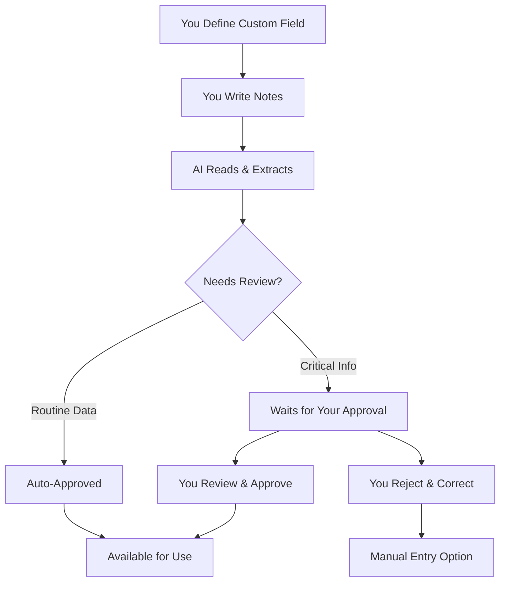

<Info>
**For Clinical Teams**: Learn how NarraFields extracts custom data from your patient notes - you define what matters to your practice.

**For Practice Managers**: See how custom fields organize clinical information without changing your workflow.
</Info>

## What is NarraFields?

<Info>
**The Problem:**
Important clinical data gets buried in notes, making it hard to track trends or find specific information quickly.
</Info>

NarraFields automatically extracts clinical information from your patient notes based on custom fields you define. 

**You decide what matters:**
- Blood pressure readings
- Medication changes  
- Symptom patterns
- Any clinical indicator important to your practice

**AI finds it in your existing documentation** - no workflow changes required.

### How It Works

<CardGroup cols={3}>
  <Card title="1. Define What Matters" icon="clipboard-list">
    "Track pain scores 1-10"
    
    You decide what to extract
  </Card>
  <Card title="2. AI Finds It" icon="robot">
    "Pain 7/10 today" → 7
    
    Automatic extraction from notes
  </Card>
  <Card title="3. Use Organized Data" icon="chart-line">
    Instant lists, trends, alerts
    
    Clinical information at your fingertips
  </Card>
</CardGroup>

Every practice is different. You define what's important to track.

## Step 1: Define Your Custom Fields

<Info>
The first step is deciding what clinical information you want to extract and track.
</Info>

### How You Create a Custom Field

<AccordionGroup>
  <Accordion title="Field Creation Process">
    **Step 1: Name Your Field**
    > "Pain Scale Rating"

    **Step 2: Describe What You Want**
    > "Extract the patient's current pain level on a 1-10 scale when mentioned in clinical notes"

    **Step 3: Give Examples**
    > - "Pain 7/10 today" → Extract: "7"
    > - "Reports pain level of 4 out of 10" → Extract: "4"  
    > - "No pain currently" → Extract: "0"

    **Step 4: Set Your Preferences**
    - **Auto-approve routine values?** (like objective pain scores)
    - **Require review for important changes?** (like severe pain increases)
    - **Update automatically when new notes are added?**
  </Accordion>
</AccordionGroup>

---

### Field Types You Can Create

<AccordionGroup>
  <Accordion title="Number Fields">
    **Perfect for measurable values:**
    - Pain scales (1-10)
    - Blood pressure readings (120/80)
    - Lab values (A1C: 7.2%)
    - Weight measurements (185 lbs)
    - Vital signs (HR: 72 bpm)
  </Accordion>

  <Accordion title="Text Fields">
    **Great for descriptive information:**
    - Medication names and dosages
    - Symptom descriptions
    - Diagnosis statements
    - Treatment plan notes
    - Patient concerns or goals
  </Accordion>

  <Accordion title="Date Fields">
    **Essential for scheduling and tracking:**
    - Last mammogram date
    - Next appointment scheduled
    - Surgery dates
    - Vaccination dates
    - Milestone achievements
  </Accordion>

  <Accordion title="Yes/No Fields">
    **Binary tracking made simple:**
    - Medication compliance (taking/not taking)
    - Symptom presence (present/absent)
    - Screening completion (done/not done)
    - Side effects (experiencing/not experiencing)
  </Accordion>

  <Accordion title="Multiple Choice">
    **When you have specific options:**
    - Severity levels (Mild/Moderate/Severe)
    - Treatment responses (Improved/Stable/Worse)
    - Risk categories (Low/Medium/High)
    - Appointment types (Follow-up/Urgent/Routine)
  </Accordion>
</AccordionGroup>

### Specialty-Specific Examples

<AccordionGroup>
  <Accordion title="Primary Care Practice">
    **Field:** Symptom Duration  
    **Field Type:** Number
    
    **Your Instructions:**
    - Extract how long the patient has been experiencing their main symptom, in days. Convert weeks to days (multiply by 7), months to days (multiply by 30). Look for phrases like "for the past", "started", "began", "since". If multiple symptoms mentioned, focus on the chief complaint.
    
    **From Note:**
    - Patient reports worsening cough that started about 3 weeks ago after a cold. Also mentions occasional headaches for years but the cough is really bothering her now.
    
    **Extracted:** 
    - 21
    
    **Impact:** 
    - AI understands context to identify chief complaint and converts time units accurately
  </Accordion>
  
  <Accordion title="Cardiology">
    **Field:** Has Chest Pain Symptoms  
    **Field Type:** Yes/No
    
    **Your Instructions:**
    - Determine if patient currently experiences any chest pain, chest discomfort, chest pressure, or chest tightness. Include related symptoms like "heaviness in chest" or "squeezing sensation". Answer "Yes" even if intermittent or mild.
    
    **From Note:**
    - Patient denies chest pain but mentions feeling pressure in her chest when walking upstairs. No pain at rest. Describes it as heaviness rather than sharp pain.
    
    **Extracted:** 
    - Yes
    
    **Impact:** 
    - AI recognizes chest pain equivalents and synonyms that might be missed
  </Accordion>
  
  <Accordion title="Family Medicine">
    **Field:** Alcohol Use Pattern  
    **Field Type:** Multiple Choice
    
    **Your Instructions:**
    - Categorize drinking pattern using these definitions: "None" = no alcohol, "Social" = occasional/special occasions only, "Regular" = weekly consumption but within guidelines, "Heavy" = daily or excessive amounts, "Concerning" = binge drinking or negative consequences mentioned.
    
    **From Note:**
    - Patient reports having a couple glasses of wine with dinner most nights, maybe a beer or two on weekends. Says it helps her relax after work but denies any problems.
    
    **Extracted:** 
    - Regular
    
    **Impact:** 
    - AI interprets drinking patterns and frequency descriptions to categorize appropriately
  </Accordion>
  
  <Accordion title="Emergency Medicine">
    **Field:** Last Tetanus Shot  
    **Field Type:** Date
    
    **Your Instructions:**
    - Extract when patient received their most recent tetanus vaccination. Look for phrases like "tetanus shot", "Tdap", "DT vaccine". Convert relative dates like "5 years ago" to approximate calendar dates. If patient says "don't remember" or unclear, leave blank.
    
    **From Note:**
    - Patient thinks he got a tetanus shot about 8 years ago when he stepped on a nail at his previous job, but can't remember exactly when.
    
    **Extracted:** 
    - 2016-01-01
    
    **Impact:** 
    - AI converts relative timeframes into usable dates for vaccination tracking
  </Accordion>
  
  <Accordion title="Urgent Care">
    **Field:** Symptom Severity Scale  
    **Field Type:** Multiple Choice
    
    **Your Instructions:**
    - Rate symptom impact on daily activities using these levels: "Minimal" = slight bother but normal activities, "Moderate" = some activity limitation, "Significant" = major impact on daily function, "Severe" = unable to perform normal activities.
    
    **From Note:**
    - Patient reports knee pain that bothers her when walking but she's still able to do her job as a teacher. Had to skip her weekly tennis game and uses the elevator instead of stairs.
    
    **Extracted:** 
    - Moderate
    
    **Impact:** 
    - AI evaluates functional impact across multiple activity domains
  </Accordion>
  
  <Accordion title="Pediatrics">
    **Field:** Weight in Kilograms  
    **Field Type:** Number
    
    **Your Instructions:**
    - Extract current weight and convert to kilograms. Look for "lbs", "pounds", "kg", "kilograms". Convert pounds to kg by dividing by 2.2. Round to one decimal place.
    
    **From Note:**
    - Child weighs 45 pounds according to mom, up from 42 pounds at last visit 3 months ago.
    
    **Extracted:** 
    - 20.5
    
    **Impact:** 
    - AI handles unit conversion and identifies current vs. historical measurements
  </Accordion>
  
  <Accordion title="Orthopedics">
    **Field:** Affected Body Parts  
    **Field Type:** Multi-Select
    
    **Your Instructions:**
    - Select all body parts currently affected by patient's condition. Options: Neck, Shoulder, Elbow, Wrist, Hand, Back, Hip, Knee, Ankle, Foot. Include areas with pain, stiffness, swelling, or functional limitation mentioned.
    
    **From Note:**
    - Patient reports right shoulder pain that radiates down to her elbow. Also mentions lower back stiffness in the mornings and occasional wrist pain from typing.
    
    **Extracted:** 
    - Shoulder, Elbow, Back, Wrist
    
    **Impact:** 
    - AI identifies multiple affected areas from complex symptom descriptions
  </Accordion>
  
  <Accordion title="Internal Medicine">
    **Field:** Currently Experiencing Fatigue  
    **Field Type:** Yes/No
    
    **Your Instructions:**
    - Determine if patient currently has fatigue, tiredness, low energy, or feeling worn out. Include synonyms like "exhausted", "drained", "no energy". Exclude normal tiredness after exercise or lack of sleep.
    
    **From Note:**
    - Patient feels fine most days but gets really tired by afternoon, more than usual. Says she's sleeping well but just doesn't have the energy she used to have.
    
    **Extracted:** 
    - Yes
    
    **Impact:** 
    - AI distinguishes pathological fatigue from normal tiredness patterns
  </Accordion>
</AccordionGroup>

## Step 2: AI Processes Your Notes

<Info>
Configure how AI processes your fields with precise control over automation, approval requirements, and fallback behavior.
</Info>

### How You Control AI Processing

<AccordionGroup>
  <Accordion title="Processing Triggers">
    **Manual Processing**: You choose when to process and which patients
    
    **Auto-Update**: Automatically processes when new notes are added
    
    **Overwrite Protection**: Preserves manual entries unless you choose otherwise
  </Accordion>

  <Accordion title="Approval Settings">
    **Auto-Approve**: Objective data (vital signs, lab values) saves immediately
    
    **Require Review**: Clinical judgments wait for your approval before saving
    
    **Custom Fallbacks**: Define what AI should do when information isn't clear
  </Accordion>
</AccordionGroup>

**Example Setup:**
Field: "Primary Diagnosis" → Auto-update enabled → Requires approval → Fallback: "Pending evaluation"

## Step 3: Review and Use Your Data

<Info>
See how NarraFields transforms your clinical notes into organized, searchable data that saves time and improves patient care.
</Info>

### Real Examples of How It Works

<AccordionGroup>
  <Accordion title="Blood Pressure Tracking">
    **Your Note:**
    > "Patient reports feeling dizzy this morning. BP check shows 165/95, up from last visit. Discussed lifestyle modifications. Started lisinopril 10mg daily."

    **What NarraFields Extracts:**
    - Blood Pressure: 165/95
    - Symptom: Dizziness
    - New Medication: Lisinopril 10mg daily

    **The Result:** Instantly find all patients with elevated BP readings without searching through notes.
  </Accordion>

  <Accordion title="Medication Management">
    **Your Note:**
    > "Patient doing well on current diabetes management. A1C improved to 7.2%. Increasing metformin from 500mg BID to 1000mg BID."

    **What NarraFields Extracts:**
    - Current A1C: 7.2%
    - Medication Change: Metformin increased to 1000mg BID
    - Diabetes Status: Well-controlled

    **The Result:** Quickly find all patients on specific medications and track changes over time.
  </Accordion>

  <Accordion title="Preventive Care Tracking">
    **Your Note:**
    > "Due for mammogram - scheduled for next month. Flu shot given today. Discussed colorectal cancer screening - patient prefers FIT test."

    **What NarraFields Extracts:**
    - Mammogram: Scheduled (due date tracked)
    - Flu Vaccine: Completed today
    - Colorectal Screening: FIT test preferred

    **The Result:** Easily track preventive care discussions and follow up with patients about pending screenings.
  </Accordion>
</AccordionGroup>

### The Approval Process

For critical clinical information, NarraFields uses a **human-in-the-loop** approach where you maintain control over what gets automatically processed versus what requires your review.

### What Gets Auto-Approved vs. Human Review

<Note>
Critical clinical information always waits for your approval. You decide what requires review when setting up each field.
</Note>

<AccordionGroup>
  <Accordion title="Usually Auto-Approved">
    **Objective measurements that are clearly documented:**
    - Vital signs (blood pressure, temperature, weight)
    - Lab values with clear results
    - Medication dosages when explicitly stated
    - Appointment dates and scheduling
    
    **Example**: "BP 120/80" → Auto-approved as objective measurement
  </Accordion>

  <Accordion title="Usually Requires Review">
    **Clinical judgments and interpretations:**
    - Diagnosis changes or new diagnoses
    - Treatment plan modifications
    - Risk assessments
    - Clinical decision-making
    
    **Example**: "Appears to have early signs of heart failure" → Requires physician review
  </Accordion>
</AccordionGroup>

## Complete Audit Trail

<Info>
Every action is tracked for clinical safety, compliance, and team coordination.
</Info>

<CardGroup cols={2}>
  <Card title="What Gets Tracked" icon="list-check">
    - AI extractions from notes
    - Approval/rejection decisions  
    - Manual value updates
    - User identity and timestamps
  </Card>
  
  <Card title="Why This Matters" icon="shield-check">
    - **Clinical Safety:** Verify data sources and track accountability
    - **Compliance:** Support regulatory reviews and documentation requirements
    - **Team Coordination:** See who updated what and when
  </Card>
</CardGroup>

<Accordion title="Audit Example">
**Field Value:** BP 150/95

**Full Trail:** Extracted from Jan 10 note "BP check shows 150/95, patient reports headache" - Dr. Johnson approved 3:45 PM
</Accordion>

## Real Clinical Impact

<Info>
See the time-saving transformation NarraFields brings to common clinical workflows.
</Info>

<AccordionGroup>
  <Accordion title="Morning Huddle Transformation">
    

      

        **Before:** "Someone check which diabetes patients mentioned blood sugar issues..."  
        *(30 minutes of manual chart review)*
      

      

        **After:** "12 patients with recent blood sugar concerns, 8 with BP >140"  
        *(Instant results from custom fields)*
      

    

  </Accordion>
  
  <Accordion title="Patient Outreach Made Easy">
    

      

        **Before:** "Review 200 charts for A1C values over 8.0..."  
        *(Hours of manual work)*
      

      

        **After:** "23 patients with A1C >8.0 ready for follow-up calls"  
        *(One-click clinical data retrieval)*
      

    

  </Accordion>
  
  <Accordion title="Patient Safety Enhanced">
    

      

        **Before:** "Did Mrs. Johnson mention drug allergies? Let me check her notes..."  
        *(Digging through multiple visit notes)*
      

      

        **After:** "Allergy field shows 'Penicillin (rash)' from March visit"  
        *(Safety information prominently displayed)*
      

    

  </Accordion>
</AccordionGroup>

## Future Potential

<Info>
While NarraFields currently focuses on extracting and organizing clinical information, the structured data it creates opens up exciting possibilities for the future.
</Info>

<AccordionGroup>
  <Accordion title="Quality Metrics Integration">
    **What could be possible:**
    - Automatic generation of quality reports from your custom fields
    - Real-time tracking of quality measures across your patient population
    - Automated identification of care gaps based on your defined criteria
    - Integration with quality reporting systems and value-based care programs
  </Accordion>

  <Accordion title="Advanced Analytics Possibilities">
    **What we're exploring:**
    - Population health insights from your custom clinical data
    - Trend analysis across your patient panels
    - Predictive analytics for patient risk stratification
    - Integration with clinical decision support systems
  </Accordion>

  <Accordion title="Enhanced Workflow Integration">
    **Future workflow improvements:**
    - Automatic alerts when critical values are detected
    - Integration with scheduling systems for follow-up reminders
    - Smart patient list generation based on custom field criteria
    - Enhanced care coordination tools based on extracted data
  </Accordion>

  <Accordion title="Specialty-Specific Enhancements">
    **Tailored future features:**
    - Specialty-specific field templates and best practices
    - Integration with specialty society quality measures
    - Advanced pattern recognition for complex clinical scenarios
    - Collaborative field definitions across similar practices
  </Accordion>
</AccordionGroup>

<Note>
**Current Focus**: NarraFields today provides the foundation - accurate extraction and organization of your chosen clinical data. These future capabilities will build on this solid base of structured, auditable clinical information.
</Note>

## Frequently Asked Questions

<AccordionGroup>
  <Accordion title="Will this change how I document?">
    **No.** Continue writing notes as usual. NarraFields extracts only the information you choose to track. No new templates required.
  </Accordion>

  <Accordion title="What if the AI gets something wrong?">
    **You're in control.** For important information, AI suggestions wait for your approval. You can approve, reject, or modify any suggestion. The AI learns from your corrections.
  </Accordion>

  <Accordion title="Is my patient data secure?">
    **Yes.** NarraFields operates within your existing secure environment. Full audit trails track all access and changes.
  </Accordion>

  <Accordion title="How accurate is the AI?">
    **Highly accurate for objective data.** Simple measurements like "BP 120/80" are nearly 100% accurate. Complex clinical judgments start around 85-90% and improve as the AI learns your patterns.
  </Accordion>

  <Accordion title="What happens to our existing data?">
    **Nothing changes.** Your existing notes remain as they are. NarraFields can process historical notes to extract information retroactively.
  </Accordion>

  <Accordion title="How long does it take to see benefits?">
    **Immediate for simple fields, weeks for complex ones.** Vital signs show benefits right away. Complex clinical fields improve over 2-4 weeks as the AI learns your documentation style.
  </Accordion>
</AccordionGroup>

<Note>
**Ready to learn more?** Ask your technical team about setting up a pilot program with a few key fields that matter most to your practice. Start small, see the benefits, then expand to more complex use cases.
</Note>

<CardGroup cols={2}>
  <Card title="Technical Documentation" icon="code" href="/narrafields-ai-custom-fields">
    Detailed API documentation for your IT team
  </Card>
  
  <Card title="Implementation Examples" icon="rocket" href="/narrafields-example-flows">
    Real-world workflow examples and code samples
  </Card>
</CardGroup>