<Info>
**For Clinical Teams**: Learn how NarraFields extracts custom data from your patient notes - you define what matters to your practice.

**For Practice Managers**: See how custom fields organize clinical information without changing your workflow.
</Info>

## What is NarraFields?

NarraFields automatically extracts clinical information from your patient notes based on custom fields you define. You decide what data matters to your practice - blood pressure readings, medication changes, symptoms, or any clinical indicator - and AI finds it in your existing documentation.

### How It Works (3 Steps)

1. **📋 You Define Custom Fields** - Decide what clinical data to track
2. **🤖 AI Processes Your Notes** - Extracts the information you specified  
3. **✅ You Review and Use Data** - Approve suggestions and access organized information

Every practice is different. You define what's important to track.

## Step 1: Define Your Custom Fields

The first step is deciding what clinical information you want to extract and track.

### How You Create a Custom Field

**Step 1: Name Your Field**
> "Pain Scale Rating"

**Step 2: Describe What You Want**
> "Extract the patient's current pain level on a 1-10 scale when mentioned in clinical notes"

**Step 3: Give Examples**
> - "Pain 7/10 today" → Extract: "7"
> - "Reports pain level of 4 out of 10" → Extract: "4"  
> - "No pain currently" → Extract: "0"

**Step 4: Set Your Preferences**
- **Auto-approve routine values?** (like objective pain scores)
- **Require review for important changes?** (like severe pain increases)
- **Update automatically when new notes are added?**

### Field Types You Can Create

<AccordionGroup>
  <Accordion title="📊 Number Fields">
    **Perfect for measurable values:**
    - Pain scales (1-10)
    - Blood pressure readings (120/80)
    - Lab values (A1C: 7.2%)
    - Weight measurements (185 lbs)
    - Vital signs (HR: 72 bpm)
  </Accordion>

  <Accordion title="📝 Text Fields">
    **Great for descriptive information:**
    - Medication names and dosages
    - Symptom descriptions
    - Diagnosis statements
    - Treatment plan notes
    - Patient concerns or goals
  </Accordion>

  <Accordion title="📅 Date Fields">
    **Essential for scheduling and tracking:**
    - Last mammogram date
    - Next appointment scheduled
    - Surgery dates
    - Vaccination dates
    - Milestone achievements
  </Accordion>

  <Accordion title="☑️ Yes/No Fields">
    **Binary tracking made simple:**
    - Medication compliance (taking/not taking)
    - Symptom presence (present/absent)
    - Screening completion (done/not done)
    - Side effects (experiencing/not experiencing)
  </Accordion>

  <Accordion title="📋 Multiple Choice">
    **When you have specific options:**
    - Severity levels (Mild/Moderate/Severe)
    - Treatment responses (Improved/Stable/Worse)
    - Risk categories (Low/Medium/High)
    - Appointment types (Follow-up/Urgent/Routine)
  </Accordion>
</AccordionGroup>

### Specialty-Specific Examples

<AccordionGroup>
  <Accordion title="🫀 Cardiology Practice">
    **Custom Fields You Might Create:**
    - **Exercise Tolerance**: "Patient walked 2 blocks without shortness of breath"
    - **Chest Pain Characteristics**: "Sharp, stabbing pain, 7/10 severity, lasts 5 minutes"
    - **Medication Adherence**: "Taking carvedilol as prescribed, no side effects"
    - **EKG Changes**: "Normal sinus rhythm, no ST changes"
    
    **Your AI learns to find**: Heart-related symptoms, exercise capacity, medication responses, and cardiac test results specifically relevant to cardiology care.
  </Accordion>

  <Accordion title="🏃‍♀️ Sports Medicine">
    **Custom Fields You Might Create:**
    - **Return to Play Status**: "Cleared for non-contact activities"
    - **Pain During Activity**: "Knee pain 4/10 with running, improves with rest"
    - **Range of Motion**: "90% ROM compared to unaffected side"
    - **Functional Milestones**: "Can perform single-leg squat without pain"
    
    **Your AI learns to find**: Activity-specific symptoms, functional improvements, and rehabilitation progress markers.
  </Accordion>

  <Accordion title="🧠 Mental Health Practice">
    **Custom Fields You Might Create:**
    - **Mood Rating**: "Patient rates mood 6/10 today, improved from last week"
    - **Sleep Quality**: "Sleeping 6 hours nightly, waking 2-3 times"
    - **Medication Side Effects**: "No weight gain noticed with current antidepressant"
    - **Therapy Progress**: "Using coping strategies, feels more confident"
    
    **Your AI learns to find**: Mood indicators, therapy progress, medication effects, and behavioral changes.
  </Accordion>

  <Accordion title="👶 Pediatrics">
    **Custom Fields You Might Create:**
    - **Growth Percentiles**: "Height 75th percentile, weight 60th percentile"
    - **Developmental Milestones**: "Walking independently, vocabulary of 20 words"
    - **Feeding Issues**: "Eating solid foods well, no choking episodes"
    - **School Performance**: "Teacher reports improved attention in class"
    
    **Your AI learns to find**: Growth patterns, developmental progress, feeding behaviors, and educational performance.
  </Accordion>
</AccordionGroup>

## Step 2: AI Processes Your Notes

Once you've defined your fields, AI automatically reads through your patient notes to extract the information.

### Teaching the AI Your Language

The system learns your documentation style:
- Your abbreviations (HTN, DM, etc.)
- Your terminology and format preferences
- Your clinical patterns

**Example:**
1. You create field: "Blood Pressure Reading" 
2. AI finds: "BP 140/90" in your notes
3. You confirm: "Yes, that's correct"
4. AI learns: Your practice uses "BP" for blood pressure
5. Next time: AI automatically recognizes "BP 130/85"

## Step 3: Review and Use Your Data

### Real Examples of How It Works

### Example 1: Blood Pressure Tracking

**Your Note:**
> "Patient reports feeling dizzy this morning. BP check shows 165/95, up from last visit. Discussed lifestyle modifications. Started lisinopril 10mg daily. Follow-up in 2 weeks to recheck."

**What NarraFields Does:**
1. 🤖 **AI Reads Your Note**: Scans the text for blood pressure information
2. 📊 **Extracts Key Data**: Identifies "165/95" as the current blood pressure
3. 📝 **Creates Structured Field**: Automatically fills "Current Blood Pressure: 165/95"
4. 🔗 **Links to Source**: Points back to your original note for context
5. ✅ **Ready for Use**: Now you can easily find all patients with elevated BP

**The Result:** Instead of searching through notes manually, you can now instantly find all patients with elevated blood pressure readings.

### Example 2: Medication Management

**Your Note:**
> "Patient doing well on current diabetes management. A1C improved to 7.2%. Increasing metformin from 500mg BID to 1000mg BID. Continue lifestyle counseling."

**What NarraFields Extracts:**
- **Current A1C**: 7.2%
- **Medication Change**: Metformin increased to 1000mg BID
- **Diabetes Status**: Well-controlled
- **Next Action**: Continue current plan

**The Benefit:** You can quickly find all patients on specific medications and track medication changes over time.

### Example 3: Preventive Care Tracking

**Your Note:**
> "Annual physical. Patient reports no new concerns. Due for mammogram - scheduled for next month. Flu shot given today. Discussed colorectal cancer screening - patient prefers FIT test."

**What Gets Organized:**
- **Mammogram**: Scheduled (due date tracked)
- **Flu Vaccine**: Completed today
- **Colorectal Screening**: FIT test preferred
- **Next Visit**: Annual follow-up

**The Impact:** You can easily track preventive care discussions and follow up with patients about pending screenings.

### The Approval Process

For critical clinical information, NarraFields uses a **human-in-the-loop** approach:

```mermaid
graph TD
    A[📋 You Define Custom Field] --> B[📝 You Write Notes] 
    B --> C[🤖 AI Reads & Extracts]
    C --> D{🩺 Needs Review?}
    D -->|Critical Info| E[⏸️ Waits for Your Approval]
    D -->|Routine Data| F[✅ Auto-Approved]
    E --> G[👩‍⚕️ You Review & Approve]
    E --> H[❌ You Reject & Correct]
    G --> I[📊 Available for Use]
    H --> J[📝 Manual Entry Option]
    F --> I
```

### What Gets Auto-Approved vs. Human Review

<AccordionGroup>
  <Accordion title="✅ Usually Auto-Approved">
    **Objective measurements that are clearly documented:**
    - Vital signs (blood pressure, temperature, weight)
    - Lab values with clear results
    - Medication dosages when explicitly stated
    - Appointment dates and scheduling
    
    **Example**: "BP 120/80" → Auto-approved as objective measurement
  </Accordion>

  <Accordion title="👩‍⚕️ Usually Requires Review">
    **Clinical judgments and interpretations:**
    - Diagnosis changes or new diagnoses
    - Treatment plan modifications
    - Risk assessments
    - Clinical decision-making
    
    **Example**: "Appears to have early signs of heart failure" → Requires physician review
  </Accordion>
</AccordionGroup>

### Complete Audit Trail

NarraFields maintains a complete audit trail of every action:

**What Gets Tracked:**
- When AI extracts values from notes
- When you approve or reject AI suggestions  
- When you manually update field values
- Who made each change and exactly when

**Why This Matters:**
- **Clinical Safety:** Verify sources, track approvals, maintain accountability
- **Compliance:** Meet documentation requirements, support regulatory reviews
- **Team Coordination:** See who updated what and when

**Example:** A patient's blood pressure field shows "150/95" and you can trace it back to: "Extracted from note dated Jan 10, 2024: 'BP check shows 150/95, patient reports headache' - Dr. Johnson approved this value on Jan 10, 2024 at 3:45 PM"

## Day-in-the-Life Scenarios

### Scenario 1: Morning Huddle

**Before NarraFields:**
> "Can someone check which of our diabetes patients mentioned blood sugar issues in their last visits? And do we know who has blood pressure readings over 140 lately?"

*Someone spends 30 minutes reviewing charts manually.*

**With NarraFields:**
> "Let me check our custom fields... I can see 12 patients with recent blood sugar concerns, and we have 8 patients with BP readings over 140 documented in their last visits."

*Information available instantly from extracted data.*

### Scenario 2: Clinical Data Retrieval

**Before NarraFields:**
> "We need to find all diabetic patients with A1C values over 8.0 for follow-up calls. Sarah, can you review 200 charts and extract the latest A1C for each?"

*Hours of manual chart review.*

**With NarraFields:**
> "I can instantly pull up all patients with A1C over 8.0 from our custom field. Here are 23 patients who need follow-up calls."

*Instant clinical data retrieval.*

### Scenario 3: Patient Safety

**Before NarraFields:**
> "Did anyone notice if Mrs. Johnson mentioned drug allergies during her last few visits? Let me check her notes..."

*Digging through multiple visit notes.*

**With NarraFields:**
> "Mrs. Johnson's allergy field shows 'Penicillin (rash)' extracted from her March visit note, and it was flagged for verification."

*Safety information prominently displayed.*

## Future Potential

While NarraFields currently focuses on extracting and organizing clinical information, the structured data it creates opens up exciting possibilities for the future:

### Potential Quality Metrics Integration
**What could be possible:**
- Automatic generation of quality reports from your custom fields
- Real-time tracking of quality measures across your patient population
- Automated identification of care gaps based on your defined criteria
- Integration with quality reporting systems and value-based care programs

### Advanced Analytics Possibilities
**What we're exploring:**
- Population health insights from your custom clinical data
- Trend analysis across your patient panels
- Predictive analytics for patient risk stratification
- Integration with clinical decision support systems

### Enhanced Workflow Integration
**Future workflow improvements:**
- Automatic alerts when critical values are detected
- Integration with scheduling systems for follow-up reminders
- Smart patient list generation based on custom field criteria
- Enhanced care coordination tools based on extracted data

### Specialty-Specific Enhancements
**Tailored future features:**
- Specialty-specific field templates and best practices
- Integration with specialty society quality measures
- Advanced pattern recognition for complex clinical scenarios
- Collaborative field definitions across similar practices

<Note>
**Current Focus**: NarraFields today provides the foundation - accurate extraction and organization of your chosen clinical data. These future capabilities will build on this solid base of structured, auditable clinical information.
</Note>

## Frequently Asked Questions

<AccordionGroup>
  <Accordion title="Will this change how I document?">
    **No.** Continue writing notes as usual. NarraFields extracts only the information you choose to track. No new templates required.
  </Accordion>

  <Accordion title="What if the AI gets something wrong?">
    **You're in control.** For important information, AI suggestions wait for your approval. You can approve, reject, or modify any suggestion. The AI learns from your corrections.
  </Accordion>

  <Accordion title="Is my patient data secure?">
    **Yes.** NarraFields operates within your existing secure environment. Full audit trails track all access and changes.
  </Accordion>

  <Accordion title="How accurate is the AI?">
    **Highly accurate for objective data.** Simple measurements like "BP 120/80" are nearly 100% accurate. Complex clinical judgments start around 85-90% and improve as the AI learns your patterns.
  </Accordion>

  <Accordion title="What happens to our existing data?">
    **Nothing changes.** Your existing notes remain as they are. NarraFields can process historical notes to extract information retroactively.
  </Accordion>

  <Accordion title="How long does it take to see benefits?">
    **Immediate for simple fields, weeks for complex ones.** Vital signs show benefits right away. Complex clinical fields improve over 2-4 weeks as the AI learns your documentation style.
  </Accordion>
</AccordionGroup>

## Next Steps

**For Clinical Teams:**
1. Identify what information you repeatedly search for
2. Define what clinical indicators matter most to your specialty
3. Start with simple, objective measurements
4. Add more complex fields as the AI learns your style

**For Practice Administrators:**
1. Assess what data extraction would improve workflows
2. Plan custom fields specific to your practice needs
3. Consider how customization addresses your challenges

---

<Note>
**Ready to learn more?** Ask your technical team about setting up a pilot program with a few key fields that matter most to your practice. Start small, see the benefits, then expand to more complex use cases.
</Note>

<CardGroup cols={2}>
  <Card title="Technical Documentation" icon="code" href="/narrafields-ai-custom-fields">
    Detailed API documentation for your IT team
  </Card>
  
  <Card title="Implementation Examples" icon="rocket" href="/narrafields-example-flows">
    Real-world workflow examples and code samples
  </Card>
</CardGroup>